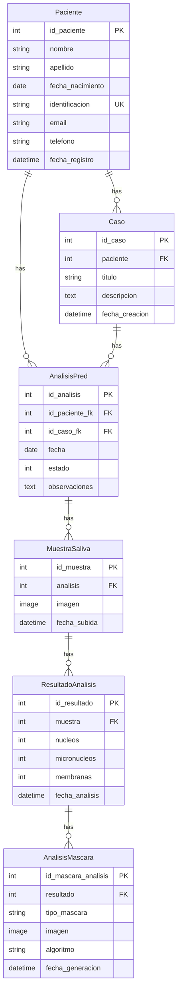
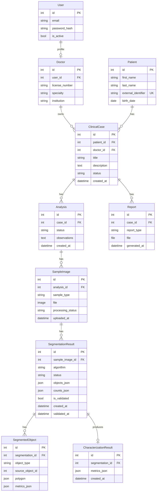

# 07 - Current Domain Model

## Current Model Diagram



## Current Domain Interpretation

### Patient

Represents the person associated with clinical/cytological studies.

Current model: `Paciente`.

### Case

Represents a clinical case or study container for a patient.

Current model: `Caso`.

### Analysis

Represents a processing/review workflow within a case.

Current model: `AnalisisPred`.

### Sample Image

Currently limited to saliva.

Current model: `MuestraSaliva`.

### Segmentation Result

Currently represented only as aggregate counts in `ResultadoAnalisis` and mask image files in `AnalisisMascara`.

### Characterization Result

Not yet modeled.

### Report

Not yet modeled.

## Domain Issues

### Issue 1: Analysis duplicates patient relationship

`AnalisisPred` links both to `Paciente` and `Caso`.

Since `Caso` already belongs to `Paciente`, this creates possible inconsistency:

```text
AnalisisPred.id_paciente_fk != AnalisisPred.id_caso_fk.paciente
```

Recommendation: make `Analysis` depend only on `Case`, or enforce validation.

### Issue 2: Sample type is not general

Current model:

```text
MuestraSaliva
```

Required domain:

```text
SampleImage
- type: SALIVA | BLOOD
```

### Issue 3: Segmentation polygons are not persisted

The microservices return object polygons, but the backend currently has no JSON field to store them.

### Issue 4: Manual validation is not represented

The documents describe specialist validation/editing. Current models do not represent:

- draft segmentation
- edited segmentation
- validated segmentation
- reviewer
- validation date

### Issue 5: Characterization is absent

The code does not yet model:

- area
- perimeter
- circularity
- centroid
- intensity
- nucleus-micronucleus relation

## Proposed Target Domain Model



## Minimal Migration Strategy

To avoid breaking the current code immediately:

1. Add `tipo_muestra` to samples or introduce `ImagenMuestra`.
2. Add `ResultadoSegmentacion` with JSON fields.
3. Keep `ResultadoAnalisis` temporarily for legacy count display.
4. Refactor frontend to consume the new result contract.
5. Migrate data from `MuestraSaliva` to `ImagenMuestra` if needed.
