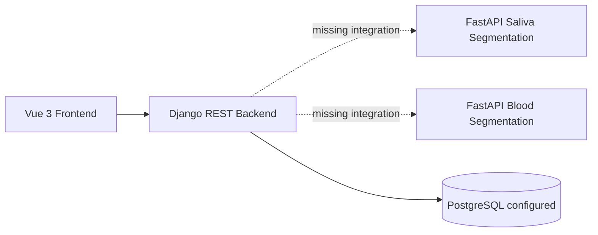
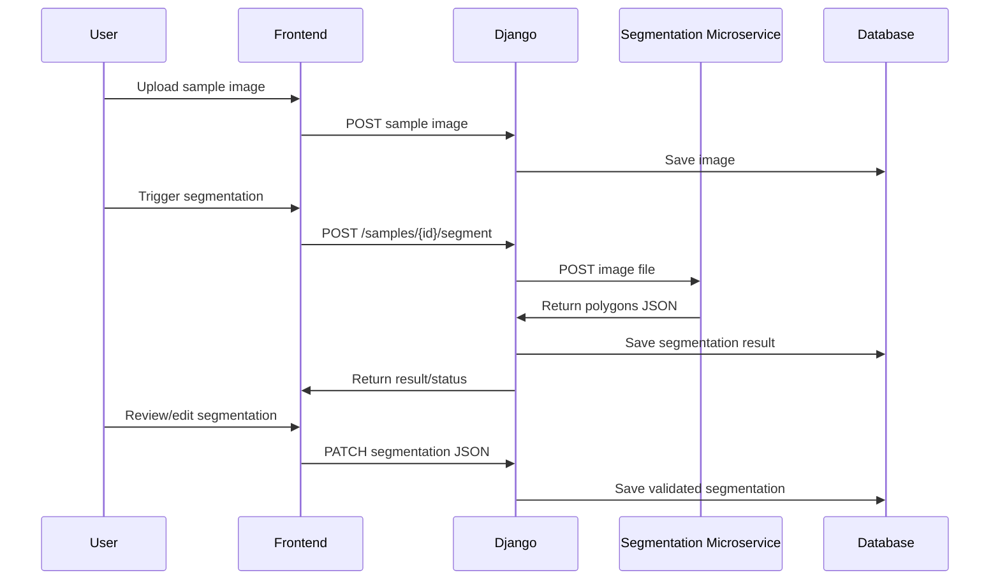

# 10 - SICAM Codex Master Context

## What SICAM Is

SICAM is a web-based system for automated and semi-automated analysis of micronuclei in microscopy images from saliva and blood samples.

Its clinical/technical purpose is to assist specialists by:

- Segmenting biological structures.
- Detecting micronuclei.
- Allowing expert validation and correction.
- Producing quantitative characterization.
- Exporting results as PDF/CSV.

SICAM is a support tool, not a replacement for specialist judgment.

## Current Codebase Shape

The current codebase is split into three projects:

```text
micronucleos-web        # Main Django + Vue web application
Segmentacion_web       # Saliva segmentation FastAPI service
segmentacion_sangre    # Blood segmentation FastAPI service
```

## Current Architecture



## Current Backend

Main backend:

```text
micronucleos-web/Backend
```

Current Django app:

```text
api
```

Current models:

```text
Paciente
Caso
AnalisisPred
MuestraSaliva
ResultadoAnalisis
AnalisisMascara
```

Current endpoints:

```text
/api/pacientes/
/api/casos/
/api/analisis/
/api/muestras/
/api/pacientes/{id}/casos/
/api/casos/{id}/analisis/
/api/analisis/{id}/cambiar_estado/
```

## Current Frontend

Main frontend:

```text
micronucleos-web/Frontend
```

Framework:

```text
Vue 3 + Vite + Axios
```

Current sections:

```text
segmentacion
registro
analisis          # placeholder
caracterizacion  # placeholder
```

Known issue:

```text
API URL is hardcoded as http://127.0.0.1:8000 in multiple components.
```

## Current Saliva Segmentation Service

Project:

```text
Segmentacion_web
```

Endpoint:

```http
POST /segmentar
```

Pipeline:

```text
bytes → RGB image → Cellpose membrane segmentation → nucleus detection → micronucleus detection → masks → polygons JSON
```

Output:

```json
{
  "objetos": [
    {
      "id": 1,
      "tipo": "membrana",
      "puntos": [[10, 20], [12, 25]]
    }
  ]
}
```

Object types:

```text
membrana
nucleo
micronucleo
```

## Current Blood Segmentation Service

Project:

```text
segmentacion_sangre
```

Endpoint:

```http
POST /api/v1/segmentar
```

Pipeline:

```text
bytes → RGB image → resize 224x224 → grayscale → gamma correction → CLAHE → sharpening → Cellpose → robust z-score → DBSCAN → circularity filter → masks → polygons JSON
```

Output:

```json
{
  "objetos": [
    {
      "id": 1,
      "tipo": "membrana",
      "puntos": [[10, 20], [12, 25]]
    },
    {
      "id": 1,
      "tipo": "micronucleo",
      "puntos": [[30, 40], [32, 45]]
    }
  ]
}
```

Object types:

```text
membrana
micronucleo
```

## Main Architectural Gap

The current backend does not yet integrate the microservices.

Target flow:



## Canonical Domain Language

Use these terms consistently during refactor:

```text
Patient / Paciente
ClinicalCase / CasoClinico
Analysis / Analisis
SampleImage / ImagenMuestra
SegmentationResult / ResultadoSegmentacion
SegmentedObject / ObjetoSegmentado
CharacterizationResult / ResultadoCaracterizacion
Report / Reporte
```

If keeping Spanish names, prefer:

```text
Paciente
CasoClinico
Analisis
ImagenMuestra
ResultadoSegmentacion
ObjetoSegmentado
ResultadoCaracterizacion
Reporte
```

## Required Sample Types

```text
SALIVA
BLOOD
```

Or Spanish equivalents:

```text
SALIVA
SANGRE
```

Pick one canonical representation and keep it stable across backend, frontend and microservices.

## Stable Segmentation Contract

Codex should preserve this contract unless explicitly instructed otherwise:

```json
{
  "objetos": [
    {
      "id": 1,
      "tipo": "membrana",
      "puntos": [[10, 20], [12, 25], [15, 28]]
    }
  ]
}
```

Recommended future normalized contract:

```json
{
  "sample_id": 123,
  "sample_type": "SALIVA",
  "objects": [
    {
      "source_id": 1,
      "type": "membrane",
      "polygon": [[10, 20], [12, 25], [15, 28]],
      "metadata": {}
    }
  ],
  "counts": {
    "membranes": 1,
    "nuclei": 0,
    "micronuclei": 0
  },
  "algorithm": {
    "name": "cellpose",
    "version": "unknown"
  }
}
```

## Refactor Constraints

Preserve:

- Current endpoints until replacements exist.
- Current frontend behavior.
- Current microservice segmentation logic.
- Current polygon output fields.
- Clinical traceability from patient to case to image to result.

Avoid:

- Rewriting Cellpose internals in the first phase.
- Renaming all models at once.
- Breaking `/api/pacientes/`, `/api/casos/`, `/api/analisis/`, `/api/muestras/`.
- Having frontend call microservices directly.
- Changing object type labels without migration.

## Recommended Refactor Sequence

### Step 1: Configuration cleanup

- `.env.example`
- Django environment variables
- Frontend `VITE_API_BASE_URL`
- microservice URL settings

### Step 2: API client centralization

- Frontend Axios client
- Backend segmentation clients

### Step 3: Segmentation persistence

- Add `ResultadoSegmentacion` model
- Store `objetos` JSON
- Store counts JSON
- Add segmentation status

### Step 4: Sample generalization

- Add sample type
- Support blood and saliva uploads
- Dispatch correct microservice by type

### Step 5: Editor persistence

- PATCH segmentation JSON
- validation status
- reviewer metadata

### Step 6: Characterization and reports

- Characterization endpoint
- CSV export
- PDF export

## Good First Codex Task

```text
Refactor only configuration.
Do not change models.
Do not change endpoint behavior.
Add environment variables and .env.example.
Preserve local development defaults.
```

## Good Second Codex Task

```text
Centralize frontend API access.
Create src/services/apiClient.js.
Use import.meta.env.VITE_API_BASE_URL.
Replace duplicated hardcoded API_URL values.
Preserve all UI behavior.
```

## Good Third Codex Task

```text
Add a Django service client module for segmentation microservices.
Do not call it from existing endpoints yet.
Implement saliva and blood client functions that accept a local image path or file object and return the parsed JSON response.
Add unit tests with mocked HTTP responses.
```
