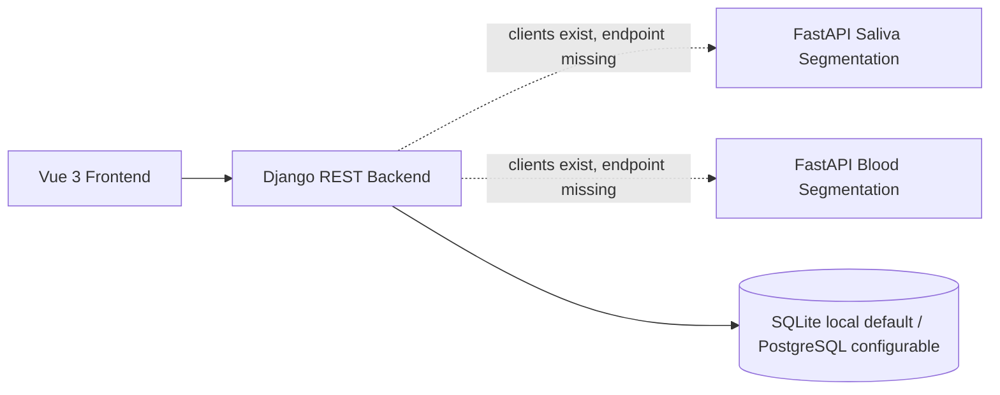
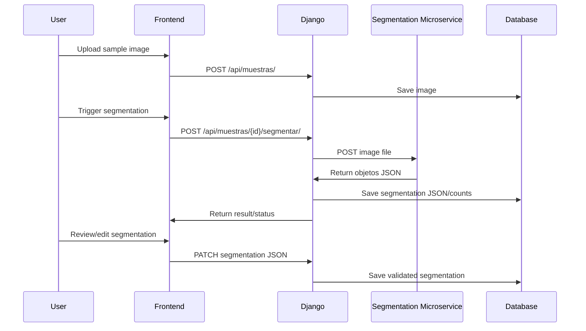

# 10 - SICAM Codex Master Context

## What SICAM Is

SICAM is a web-based system for automated and semi-automated analysis of micronuclei in microscopy images from saliva and blood samples.

Its clinical/technical purpose is to assist specialists by:

- segmenting biological structures;
- detecting micronuclei;
- allowing expert validation and correction;
- producing quantitative characterization;
- exporting results as PDF/CSV.

SICAM is a support tool, not a replacement for specialist judgment.

## Repository Source Context

The refactored workspace was built from three previous repositories:

```text
micronucleos-web      # Django + Vue web application
Segmentacion_web     # Saliva segmentation FastAPI service
segmentacion_sangre  # Blood segmentation FastAPI service
```

Current workspace paths:

```text
apps/web/
apps/segmentation-saliva/
apps/segmentation-blood/
```

Treat this as the current monorepo structure. Do not merge, move or restructure these folders unless explicitly requested.

## Current Architecture



## Current Backend

Main backend:

```text
apps/web/Backend
```

Current Django app:

```text
api
```

Current models:

```text
Paciente
Caso
AnalisisPred
MuestraSaliva
ResultadoAnalisis
AnalisisMascara
```

Current endpoints:

```text
/api/pacientes/
/api/casos/
/api/analisis/
/api/muestras/
/api/pacientes/{id}/casos/
/api/casos/{id}/analisis/
/api/analisis/{id}/cambiar_estado/
```

Missing endpoint:

```http
POST /api/muestras/{id}/segmentar/
```

## Backend Configuration Status

Django settings are externalized with `django-environ`.

Current environment example:

```text
apps/web/Backend/.env.example
```

Configuration includes:

- security settings;
- database settings;
- CORS origins;
- language/timezone;
- saliva and blood segmentation service URLs/timeouts.

The local default database is SQLite. PostgreSQL is configurable but not hardcoded as the default.

## Backend Segmentation Client Status

Django already has segmentation clients:

```text
apps/web/Backend/api/services/segmentation/
├── base_client.py
├── saliva_client.py
├── blood_client.py
├── exceptions.py
├── factory.py
├── tests.py
└── USAGE.md
```

Public helpers:

```python
from api.services.segmentation import get_segmentation_client, segment_image
```

Supported keys:

```text
SALIVA
SANGRE
```

Important boundary: these clients are not yet wired into any existing DRF endpoint.

## Current Frontend

Main frontend:

```text
apps/web/Frontend
```

Framework:

```text
Vue 3 + Vite + Axios
```

Current sections:

```text
segmentacion
registro
analisis          # placeholder
caracterizacion  # placeholder
```

Frontend API status:

```text
src/services/apiClient.js exists
VITE_API_BASE_URL is used
.env.example exists
```

No hardcoded Django API base URL remains in `apps/web/Frontend/src`.

## Current Saliva Segmentation Service

Project path:

```text
apps/segmentation-saliva
```

Source repository:

```text
Segmentacion_web
```

Endpoint:

```http
POST /segmentar
```

Pipeline:

```text
bytes -> RGB image -> Cellpose membrane segmentation -> nucleus detection -> micronucleus detection -> masks -> polygons JSON
```

Output:

```json
{
  "objetos": [
    {
      "id": 1,
      "tipo": "membrana",
      "puntos": [[10, 20], [12, 25]]
    }
  ]
}
```

Object types:

```text
membrana
nucleo
micronucleo
```

## Current Blood Segmentation Service

Project path:

```text
apps/segmentation-blood
```

Source repository:

```text
segmentacion_sangre
```

Endpoint:

```http
POST /api/v1/segmentar
```

Pipeline:

```text
bytes -> RGB image -> resize 224x224 -> grayscale -> gamma correction -> CLAHE -> sharpening -> Cellpose -> robust z-score -> DBSCAN -> circularity filter -> masks -> polygons JSON
```

Output:

```json
{
  "objetos": [
    {
      "id": 1,
      "tipo": "membrana",
      "puntos": [[10, 20], [12, 25]]
    },
    {
      "id": 2,
      "tipo": "micronucleo",
      "puntos": [[30, 40], [32, 45]]
    }
  ]
}
```

Object types:

```text
membrana
micronucleo
```

## Main Architectural Gap

The current backend has clients for the microservices, but does not yet orchestrate segmentation through an API endpoint.

Target flow:



## Current Validation Status

The repository has been sanitized and documented, but a minimal technical validation pass is still pending.

Pending validation:

- Django backend checks/tests in the current environment.
- Vue frontend dependency install and build.
- Saliva FastAPI service startup and endpoint smoke test.
- Blood FastAPI service startup and endpoint smoke test.
- Local runbook/deployment documentation for all services.

Do not assume the integrated runtime is validated until these checks are performed and documented.

## Canonical Domain Language

Use these terms consistently during refactor:

```text
Patient / Paciente
ClinicalCase / CasoClinico
Analysis / Analisis
SampleImage / ImagenMuestra
SegmentationResult / ResultadoSegmentacion
SegmentedObject / ObjetoSegmentado
CharacterizationResult / ResultadoCaracterizacion
Report / Reporte
```

If keeping Spanish names, prefer:

```text
Paciente
CasoClinico
Analisis
ImagenMuestra
ResultadoSegmentacion
ObjetoSegmentado
ResultadoCaracterizacion
Reporte
```

Do not rename existing models until a migration plan is approved.

## Required Sample Types

Use canonical sample type values consistently:

```text
SALIVA
SANGRE
```

The current Django segmentation factory uses `SANGRE`, not `BLOOD`.

## Stable Segmentation Contract

Codex should preserve this microservice contract unless explicitly instructed otherwise:

```json
{
  "objetos": [
    {
      "id": 1,
      "tipo": "membrana",
      "puntos": [[10, 20], [12, 25], [15, 28]]
    }
  ]
}
```

Important labels:

```text
membrana
nucleo
micronucleo
```

Recommended future normalized contract:

```json
{
  "sample_id": 123,
  "sample_type": "SALIVA",
  "objects": [
    {
      "source_id": 1,
      "type": "membrane",
      "polygon": [[10, 20], [12, 25], [15, 28]],
      "metadata": {}
    }
  ],
  "counts": {
    "membranes": 1,
    "nuclei": 0,
    "micronuclei": 0
  },
  "algorithm": {
    "name": "cellpose",
    "version": "unknown"
  }
}
```

Treat this normalized contract as future-facing only.

## Refactor Constraints

Preserve:

- current endpoints until replacements exist;
- current frontend behavior;
- current microservice segmentation logic;
- current polygon output fields;
- clinical traceability from patient to case to image to result.

Avoid:

- rewriting Cellpose internals in the first phase;
- renaming all models at once;
- breaking `/api/pacientes/`, `/api/casos/`, `/api/analisis/`, `/api/muestras/`;
- having frontend call microservices directly;
- changing object type labels without migration.

## Updated Refactor Sequence

### Step 0: Baseline sanitation - done

- `.gitignore`
- generated/local file cleanup
- backend `.env.example`
- frontend `.env.example`
- Django environment variables
- frontend `VITE_API_BASE_URL`
- frontend `apiClient`
- Django segmentation clients

### Step 1: Minimal technical validation

- Validate Django backend checks/tests.
- Validate Vue frontend build.
- Validate both FastAPI services can start.
- Smoke-test microservice segmentation endpoints with controlled inputs where feasible.
- Document run/deployment commands and any environment assumptions.

### Step 2: Segmentation endpoint

- Add `POST /api/muestras/{id}/segmentar/`.
- Use existing Django segmentation clients.
- Map service errors to API responses.
- Preserve current endpoints.

### Step 3: Segmentation persistence

- Add `ResultadoSegmentacion` or equivalent.
- Store raw `objetos` JSON.
- Store derived counts.
- Track status/error metadata.

### Step 4: Sample generalization

- Add or migrate toward `ImagenMuestra`.
- Add `tipo_muestra`.
- Support saliva and blood uploads.
- Dispatch correct microservice by type.

### Step 5: Editor persistence

- PATCH segmentation JSON.
- validation status.
- reviewer metadata.
- revision history if needed.

### Step 6: Characterization and reports

- Characterization endpoint.
- CSV export.
- PDF export.

## Good Next Codex Task

```text
Validate the SICAM refactored repository.
Do not change source code.
Run backend, frontend and microservice checks as far as the environment allows.
Report commands, outputs, blockers and next fixes.
```

## Good Functional Task After Validation

```text
Add POST /api/muestras/{id}/segmentar/ to the Django backend.
Use api.services.segmentation.segment_image().
Do not change existing endpoints.
Do not rename models.
Do not change segmentation algorithms.
Add focused tests for success and service error handling.
```

## Still Pending By Requirement

- `POST /api/muestras/{id}/segmentar/`.
- Persistence of segmentation JSON.
- Generalization from `MuestraSaliva` to `ImagenMuestra`.
- Validation workflow.
- Characterization.
- Reports.
